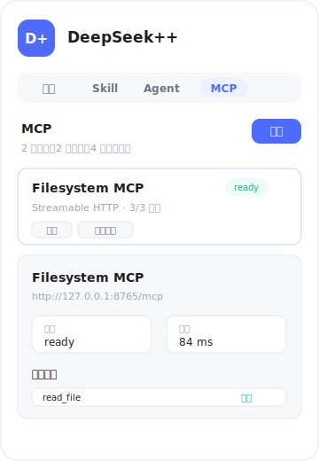
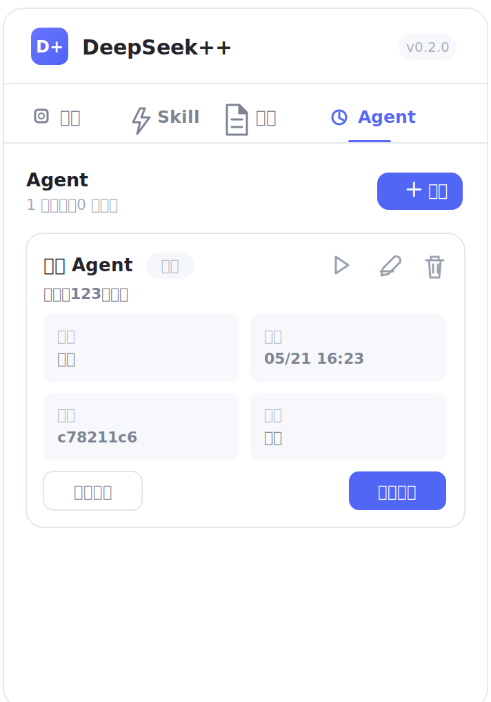

# DeepSeek++

为 [DeepSeek](https://chat.deepseek.com) 网页版注入 **类原生工具调用**、**MCP 工具系统**、**Agentic 记忆系统**、**Skill 技能系统**、**系统提示词预设** 和 **Agent 任务** 的 Chrome / Edge / Firefox 扩展。

让 DeepSeek 像支持原生 tools 一样自动执行记忆保存、更新、删除和 MCP 工具调用，拥有跨对话长期记忆，并通过 `/skill` 指令一键切换专家模式；也可以用 Codex 风格的 Agent run，把固定任务放进独立运行会话里立即执行或按计划重复执行。

## 核心功能

### 类原生工具调用

- **自动识别与执行** — 模型输出工具调用请求后，扩展自动识别并执行，不需要用户复制或手动确认
- **隐藏原始调用** — 页面不会暴露工具调用的技术细节，只展示简洁的执行结果
- **原生观感** — 执行结果渲染成类似「已思考」的折叠区块，例如「已执行工具（2次）」并逐条展示结果
- **多工具连续执行** — 同一条回复可以执行多次工具调用，适合把多个独立事实分别保存为多条记忆
- **刷新后恢复** — 工具执行记录在刷新会话后仍能恢复展示

<p align="center">
  
</p>

### MCP 工具系统

- **支持多种传输方式** — 支持 Streamable HTTP、SSE、本地 stdio bridge 和浏览器 Native Messaging
- **默认自动执行** — 新增 MCP 服务默认自动执行，可在侧边栏按服务或单个工具切换为手动
- **权限管理** — 侧边栏可直接授权、测试连接、刷新工具和查看状态
- **结果自动回传** — 工具执行完成后，结果自动发回同一会话继续生成，实现多轮工具调用
- **AgentRun 连续执行** — Agent 任务复用同一套 MCP 工具能力，最多连续 8 轮工具调用；普通聊天的自动续跑仍限制为 3 轮
- **本地安全** — MCP 配置和密钥保存在浏览器本地，WebDAV 同步不会同步敏感信息

<p align="center">
  
</p>

### OfficeCLI 文档工具

- **内置 `/officecli` skill** — 面向 `.docx`、`.xlsx`、`.pptx` 的检查、问题定位、验证和受控修改流程
- **本地 MCP provider** — 扩展不直接执行本机命令，OfficeCLI 通过本地 Streamable HTTP MCP provider 暴露固定工具
- **安全默认值** — 侧边栏 OfficeCLI 预设只自动注入状态、读取、问题检查、验证和预览工具；创建和批量修改工具默认不放行
- **根目录白名单** — provider 只允许访问启动时 `--root` 指定目录下的 Office 文件
- **显式写入开关** — 修改文档必须同时满足 provider 以 `--write enabled` 启动，且 MCP 工具列表中手动放行写工具

启动本地 provider：

```bash
npm run officecli:mcp -- --root /path/to/documents
```

如需允许批量修改：

```bash
npm run officecli:mcp -- --root /path/to/documents --write enabled
```

然后在侧边栏 `MCP` 页点击 `OfficeCLI` 创建预设，授权 `http://127.0.0.1:26316/mcp`，再点击测试和刷新工具。`officecli_status` 会把 provider 当前的 roots、相对路径基准和写入状态暴露给模型，避免让模型猜工作目录。

### 记忆系统

- **自动记忆** — AI 在对话中识别到关键信息时，自动保存为长期记忆
- **智能注入** — 每次对话时，根据关键词匹配、置顶权重、访问频率等维度，自动筛选相关记忆注入上下文
- **四种类型** — 用户画像 (`user`)、行为反馈 (`feedback`)、话题上下文 (`topic`)、参考资料 (`reference`)
- **侧边栏管理** — 查看、编辑、置顶、删除记忆，支持按类型筛选和标签管理
- **导入/导出** — JSON 格式批量备份和恢复

<p align="center">
  
</p>

### Skill 技能系统

- **内置技能** — 预设 9 个开箱即用的技能：极致深度思考、前端设计、文档协作、品牌指南、算法艺术、PPT 设计等
- **自定义技能** — 在侧边栏创建专属技能，定义系统指令和参数
- **`/` 触发** — 在聊天框输入 `/` 弹出自动补全面板，选择技能后自动注入对应的 system prompt
- **记忆联动** — 技能可选择是否同时注入记忆上下文

<p align="center">
  
  <br>
  
</p>

### 系统提示词预设

- **自定义预设** — 在侧边栏创建多个系统提示词预设，定义全局角色设定或行为指令
- **一键激活** — 同一时间只有一个预设处于激活状态，激活后自动生效
- **首条注入** — 每次新对话的首条消息前自动注入激活预设的内容
- **与技能/记忆共存** — 预设内容与 Skill 指令和记忆上下文叠加生效

### Agent 任务

- **像 Codex Agent run 一样运行** — 在侧边栏「Agent」页创建任务，点击「立即运行」即可把 prompt 发送到 DeepSeek，也可以启用定时频率自动触发
- **每个任务独立会话** — 首次运行自动创建独立会话，后续运行复用该会话，适合连续追踪同一主题
- **灵活调度** — 支持手动触发、cron 表达式（如 `0 9 * * *`）和 RRULE（如 `FREQ=HOURLY;INTERVAL=1`），最小间隔 15 分钟
- **可暂停、编辑和删除** — 任务卡片支持暂停/启用、编辑 prompt 与频率、删除任务，以及打开对应会话
- **运行状态可追踪** — 展示下次运行、上次运行、最近状态和错误信息
- **复用现有增强能力** — Agent prompt 会经过预设、记忆和 MCP 工具调用链路

<p align="center">
  
</p>

## 安装

### 从源码构建

```bash
git clone https://github.com/zhu1090093659/deepseek-pp.git
cd deepseek-pp
npm install
npm run build
```

默认 `npm run build` 生成 Chrome MV3 产物。跨浏览器构建：

```bash
npm run build:chrome
npm run build:edge
npm run build:firefox
npm run build:all
```

OfficeCLI provider 的 smoke check：

```bash
npm run smoke:officecli
```

| 浏览器 | 加载入口 | 构建目录 |
|--------|----------|----------|
| Chrome | `chrome://extensions/` → 加载已解压的扩展程序 | `dist/chrome-mv3/` |
| Edge | `edge://extensions/` → 加载解压缩的扩展 | `dist/edge-mv3/` |
| Firefox | `about:debugging#/runtime/this-firefox` → 临时载入附加组件 | `dist/firefox-mv3/manifest.json` |

## 友情链接

- [Awesome-Prompts 角色扮演](https://github.com/dongshuyan/Awesome-Prompts/tree/master/%E8%A7%92%E8%89%B2%E6%89%AE%E6%BC%94) — 精选角色扮演 Prompt 合集
- [LINUX DO](https://linux.do) — 新一代开源技术社区

## License

MIT
