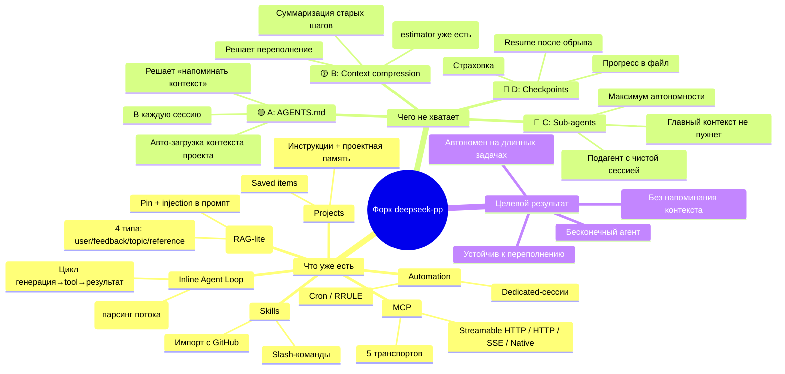

# Ментальная карта форка — путь к «бесконечному» агенту

## Ссылки

- Вики проекта: https://deepwiki.com/zhu1090093659/deepseek-pp/1-overview
- ROADMAP форка: [`ROADMAP_FORK.md`](../ROADMAP_FORK.md)
- Аналог у Claude: `CLAUDE.md` + auto-compact + subagents + checkpoints
