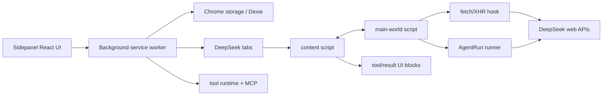

# Project Overview

## Preliminary Direction

Refactor DeepSeek++ from a chat-page augmentation model into a Codex-style Agent run model: a run has an explicit task, session state, tool loop, continuation policy, telemetry, and final result, while the DeepSeek chat UI becomes one runtime surface instead of the primary abstraction.

## Current Architecture



DeepSeek++ is a WXT MV3 browser extension. Its production runtime is split across a background service worker, an isolated content script, a main-world script injected into `chat.deepseek.com`, and a React sidepanel.

The original product behavior was centered on chatbot augmentation; after the direct AgentRun pivot, the new implementation moves the task/run path into `core/agent/*`:

- `core/interceptor/fetch-hook.ts` mutates user chat requests, injects presets/memory/skills/tool schemas, parses streamed assistant text, hides XML tool tags, and emits response-complete events.
- `entrypoints/content.ts` bridges main-world events to extension APIs, executes tool calls through the background runtime, renders tool result blocks, and performs manual MCP continuation after a chat reply.
- `core/agent/engine.ts`, `policy.ts`, `telemetry.ts`, `prompt-context.ts`, and `service.ts` now hold the Agent loop, continuation policy, telemetry summary, prompt context port, and page-dispatch lifecycle.
- `core/agent/deepseek-web-adapter.ts` owns DeepSeek session creation, completion stream, PoW, history reads, and payload validation; `deepseek-runner.ts` composes that adapter into AgentRun results.
- `entrypoints/background.ts` owns Agent task scheduling and dispatches AgentRun requests into a DeepSeek tab so the page context can reuse login and PoW behavior.

The important architectural fact is that AgentRun is now the primary abstraction: scheduled tasks, sidepanel run-now, and manual tool continuation use AgentRun contracts instead of legacy automation objects.

## Technology Stack

| Layer | Current | Target |
|:--|:--|:--|
| Language | TypeScript | TypeScript |
| Extension framework | WXT / Chrome MV3 / Edge / Firefox MV3 | Same |
| UI | React 19 + Tailwind CSS 4 sidepanel | Agent run dashboard plus existing config pages |
| Runtime orchestration | Background service worker + content/main-world bridges | Background-owned run lifecycle, page-owned DeepSeek transport |
| Model transport | DeepSeek web endpoints from page context | Agent run transport adapter over DeepSeek web endpoints |
| Tool protocol | XML tool calls parsed from assistant text | Same external prompt protocol, but driven by Agent run loop contracts |
| Tool execution | Provider-neutral `ToolDescriptor`, `ToolCall`, `ToolResult`; local memory + MCP | Same runtime, invoked through run steps with telemetry |
| Persistence | Chrome storage + Dexie | Run/session state in Chrome storage; existing stores reused |
| Build | WXT + TypeScript | Same |

## Entry Points

| Entry point | Current role | Agent-run target role |
|:--|:--|:--|
| `entrypoints/background.ts` | Message router, storage coordinator, scheduler, AgentRun tab dispatcher | Thin coordinator for Agent run commands, store updates, and tab dispatch |
| `entrypoints/content.ts` | DOM integration, tool result blocks, manual MCP continuation, AgentRun bridge | Page bridge and renderer only; no runner policy |
| `entrypoints/main-world.content.ts` | Installs fetch hook and runs AgentRun requests in page context | Owns DeepSeek web transport adapter and fetch hook installation |
| `core/agent/engine.ts` | Provider-neutral Agent loop, MCP tool continuation, finalization flow | Environment-agnostic Agent run engine |
| `core/agent/deepseek-web-adapter.ts` | DeepSeek session, PoW, completion, and history adapter | Replaceable page-context transport adapter |
| `core/agent/deepseek-runner.ts` | Composes prompt augmentation, DeepSeek adapter, engine, result steps, and telemetry | Provider-specific AgentRun result assembler |
| `core/agent/scheduler.ts` | Scheduled Agent task queue, retry/timeout, and run completion | Depends on injected Agent run executor |
| `core/tool/*` | Tool descriptor catalog, parser support, runtime execution, history | Reused as Agent run tool port |
| `core/mcp/*` | MCP server config, discovery, transports, execution | Reused as tool provider implementation |
| `core/prompt/augmentation.ts` | Prompt assembly for memory, preset, tools | Reused through an explicit prompt-context port |
| `entrypoints/sidepanel/pages/AgentRunsPage.tsx` | Agent task CRUD and recent run display | Candidate to rename/reframe as Agent Runs or Tasks |

## Build & Run

```bash
npm install
npm run compile
npm run smoke:mcp
npm run verify:mcp:mock
npm run build
npm run zip
```

`package.json` currently has no unit test runner. The available validation suite is TypeScript compile, WXT builds/zips, MCP smoke checks, and live extension/browser checks.

## External Integrations

- DeepSeek web APIs: `/api/v0/chat/completion`, `/api/v0/chat/history_messages`, `/api/v0/chat/create_pow_challenge`, `/api/v0/chat_session/create`.
- Browser extension APIs: `chrome.runtime`, `chrome.tabs`, `chrome.storage`, `chrome.alarms`, `chrome.permissions`, `chrome.sidePanel`, `nativeMessaging`.
- MCP transports: Streamable HTTP, SSE, stdio bridge, native messaging.
- Local OfficeCLI MCP provider through `scripts/officecli-mcp-server.mjs`.
- WebDAV sync for memory/skills/presets; MCP secrets are intentionally local.

## Current Working Tree Note

The repository already has broad uncommitted changes touching runner, tool parsing, MCP, prompt augmentation, token speed, OfficeCLI, README, and docs. This analysis treats the working tree as the current design baseline and does not assume those changes are disposable.

## Detected Tracking Mode

`GITHUB_STANDARD`

The GitHub CLI is available, authenticated, can resolve `zhu1090093659/deepseek-pp`, and can access Issues. Project-board access is not available, so this workflow should use GitHub Issues and Milestones without a Project board unless auth is refreshed with project scope.
