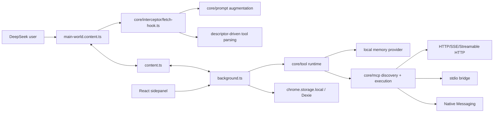

# Project Overview

## Preliminary Direction

Productize OfficeCLI inside DeepSeek++ by adding a built-in `/officecli` skill and exposing controlled local Office document operations through MCP, stdio bridge, or browser Native Messaging execution.

## Current Architecture



DeepSeek++ is a WXT MV3 browser extension. The runtime is split across three extension layers:

- `entrypoints/main-world.content.ts` installs the DeepSeek fetch/XHR hook, mutates prompts, observes streamed responses, and sends detected tool calls to the isolated content script.
- `entrypoints/content.ts` bridges page messages to the extension runtime, renders tool result blocks, restores prior executions, and triggers manual MCP result continuation.
- `entrypoints/background.ts` owns storage, message routing, MCP server management, tool runtime execution, automation scheduling, and state broadcasts.

The current tool platform is already provider-neutral enough for OfficeCLI: tool schemas are represented as `ToolDescriptor`, model output is parsed into `ToolCall`, and execution returns `ToolResult`. MCP support already includes Streamable HTTP, HTTP POST, SSE, stdio bridge, and Native Messaging transports.

The architectural boundary is important: a browser extension cannot execute the `officecli` binary directly. OfficeCLI execution must live behind an external local MCP server, a local bridge, or a browser Native Messaging host.

## Technology Stack

| Layer | Current | Target |
|:--|:--|:--|
| Language | TypeScript | TypeScript plus optional Node helper for local OfficeCLI provider |
| Extension Framework | WXT MV3 | WXT MV3 |
| UI | React 19 + Tailwind CSS 4 | Reuse sidepanel Skill and MCP surfaces; add only thin OfficeCLI onboarding if needed |
| Storage | `chrome.storage.local`, Dexie | Existing storage; OfficeCLI secrets and local roots must not sync through WebDAV |
| Tool Protocol | XML tags with JSON body, descriptor driven | Same protocol, with OfficeCLI tools discovered from an MCP/native provider |
| Local Execution | MCP bridge/native messaging support exists | Constrained OfficeCLI provider with explicit roots, version/capability reporting, and structured errors |
| Build | WXT, TypeScript compiler | Same |
| Verification | `smoke:mcp`, `verify:mcp:mock` | Add OfficeCLI provider and artifact smoke coverage |

## Entry Points

| Area | Files | Relevance |
|:--|:--|:--|
| Built-in skills | `core/skill/builtin.ts`, `core/skill/registry.ts`, `core/skill/parser.ts` | Add `/officecli` as a prompt skill; keep it non-executable. |
| Prompt/tool schema | `core/prompt/augmentation.ts`, `core/tool/*`, `core/interceptor/tool-parser.ts` | OfficeCLI tools should enter as descriptors, not hardcoded prompt text. |
| MCP runtime | `core/mcp/*`, `core/tool/runtime.ts` | Best existing execution path for OfficeCLI capabilities. |
| Extension bridge | `entrypoints/background.ts`, `entrypoints/content.ts`, `entrypoints/main-world.content.ts` | Already routes tool descriptors and calls between page, content, and background. |
| Management UI | `entrypoints/sidepanel/pages/SkillPage.tsx`, `entrypoints/sidepanel/pages/McpPage.tsx` | Skill list and MCP server/tool configuration already exist. |
| Verification | `scripts/mcp-smoke.mjs`, `scripts/mcp-live-mock.mjs` | Extend with OfficeCLI wrapper tests rather than creating a parallel harness. |
| Docs | `README.md`, `docs/verification/*` | Need OfficeCLI install, local boundary, and data-access documentation. |

## Build & Run

```bash
npm run dev
npm run compile
npm run smoke:mcp
npm run verify:mcp:mock
npm run build:all
npm run zip:all
```

Observed local OfficeCLI version during analysis: `1.0.88`.

## External Integrations

- DeepSeek web APIs and SSE stream format.
- Chrome/Edge/Firefox WebExtension APIs, including `storage`, `alarms`, `tabs`, optional host permissions, and Native Messaging.
- MCP JSON-RPC lifecycle: `initialize`, `notifications/initialized`, `tools/list`, `tools/call`.
- `officecli` local binary for `.docx`, `.xlsx`, and `.pptx` operations.
- Optional local HTTP bridge or Native Messaging host for OfficeCLI execution.

## Current Tracking Mode

GitHub pre-flight detected `GITHUB_STANDARD` for `zhu1090093659/deepseek-pp`: the repository and Issues are available through `gh`, but GitHub Project board access is not available. Planning should create labels, milestones, and Issues, but skip Project board creation unless project scope is enabled later.

## Worktree Note

The repository already has unrelated uncommitted changes in tool parsing, prompt augmentation, MCP UI copy, token speed indicator artifacts, and archived docs. OfficeCLI work should avoid reverting or overwriting those changes and should read overlapping files carefully before edits.
