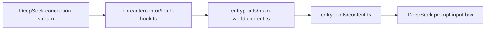

# Project Overview

## Preliminary Direction

Add a live token output speed indicator to the DeepSeek chat page, shown in the upper-right corner of the prompt input box while an assistant response is streaming.

## Current Architecture



DeepSeek++ is a WXT MV3 browser extension. The response stream is intercepted in the main-world hook, then status is forwarded to the isolated content script through `window.postMessage`. Existing page decorations, such as tool blocks and background styling, are owned by `entrypoints/content.ts`.

## Technology Stack

| Layer | Current | Target |
|:--|:--|:--|
| Language | TypeScript | TypeScript |
| Extension framework | WXT / MV3 | unchanged |
| UI | DOM integration plus React sidepanel | content-script DOM badge |
| Build tool | WXT / TypeScript | unchanged |
| Package manager | npm | unchanged |
| Deployment | Browser extension package | unchanged |

## Entry Points

- `core/interceptor/fetch-hook.ts`: parses fetch/XHR completion streams and can measure output progress.
- `entrypoints/main-world.content.ts`: bridges hook callbacks to the content script.
- `entrypoints/content.ts`: owns DeepSeek page DOM decoration and should render the indicator.
- `core/memory/selector.ts`: currently contains the token estimator used by prompt budgeting.

## Build & Run

```bash
npm run compile
npm run build
```

There is no dedicated unit test runner in `package.json`; validation depends on TypeScript compile and WXT build for this feature.

## External Integrations

- DeepSeek chat page DOM.
- DeepSeek `/api/v0/chat/completion` response stream.
- Browser `window.postMessage` bridge between main-world and content scripts.

## Tracking Mode

Pre-flight detected GitHub CLI access with repo scope, equivalent to `GITHUB_STANDARD`. For this single-session localized feature, tracking is kept in `LOCAL_ONLY` documents to avoid creating remote Issues and milestones for a one-phase UI enhancement.
