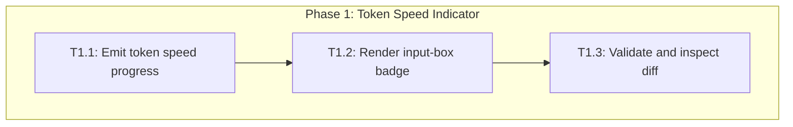

# Task Dependency Graph

```mermaid
graph TD
    subgraph Phase1 ["Phase 1: Token Speed Indicator"]
        T1_1["T1.1: Emit token speed progress"]
        T1_2["T1.2: Render input-box badge"]
        T1_3["T1.3: Validate and inspect diff"]
        T1_1 --> T1_2
        T1_2 --> T1_3
    end
```
