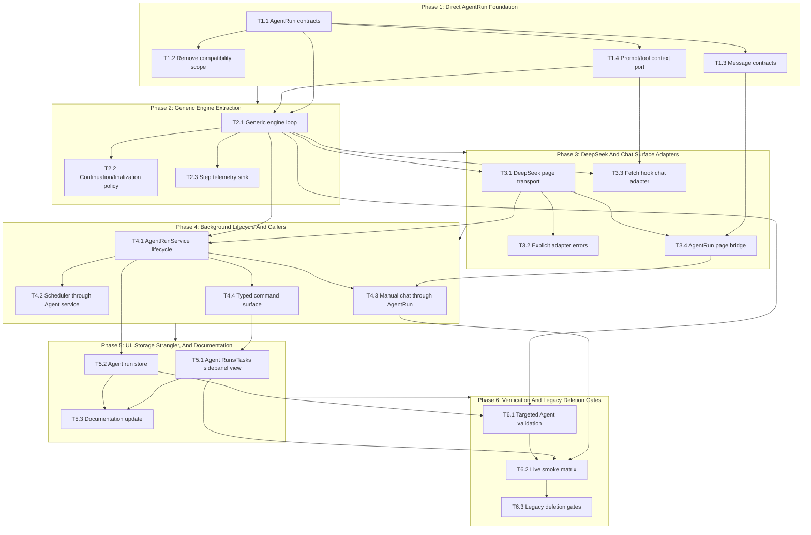
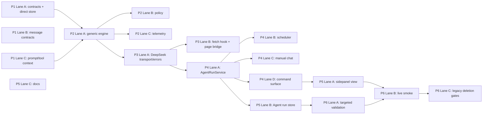

# Task Dependency Graph

```mermaid
graph TD
    subgraph P1 ["Phase 1: Direct AgentRun Foundation"]
        T1_1["T1.1 AgentRun contracts"]
        T1_2["T1.2 Remove compatibility scope"]
        T1_3["T1.3 Message contracts"]
        T1_4["T1.4 Prompt/tool context port"]
        T1_1 --> T1_2
        T1_1 --> T1_3
        T1_1 --> T1_4
    end

    subgraph P2 ["Phase 2: Generic Engine Extraction"]
        T2_1["T2.1 Generic engine loop"]
        T2_2["T2.2 Continuation/finalization policy"]
        T2_3["T2.3 Step telemetry sink"]
        T1_1 --> T2_1
        T1_4 --> T2_1
        T2_1 --> T2_2
        T2_1 --> T2_3
    end

    subgraph P3 ["Phase 3: DeepSeek And Chat Surface Adapters"]
        T3_1["T3.1 DeepSeek page transport"]
        T3_2["T3.2 Explicit adapter errors"]
        T3_3["T3.3 Fetch hook chat adapter"]
        T3_4["T3.4 AgentRun page bridge"]
        T2_1 --> T3_1
        T3_1 --> T3_2
        T1_4 --> T3_3
        T2_1 --> T3_3
        T1_3 --> T3_4
        T3_1 --> T3_4
    end

    subgraph P4 ["Phase 4: Background Lifecycle And Callers"]
        T4_1["T4.1 AgentRunService lifecycle"]
        T4_2["T4.2 Scheduler through Agent service"]
        T4_3["T4.3 Manual chat through AgentRun"]
        T4_4["T4.4 Typed command surface"]
        T2_1 --> T4_1
        T3_1 --> T4_1
        T4_1 --> T4_2
        T3_4 --> T4_3
        T4_1 --> T4_3
        T4_1 --> T4_4
    end

    subgraph P5 ["Phase 5: UI, Storage Strangler, And Documentation"]
        T5_1["T5.1 Agent Runs/Tasks sidepanel view"]
        T5_2["T5.2 Agent run store"]
        T5_3["T5.3 Documentation update"]
        T4_4 --> T5_1
        T4_1 --> T5_2
        T5_1 --> T5_3
        T5_2 --> T5_3
    end

    subgraph P6 ["Phase 6: Verification And Legacy Deletion Gates"]
        T6_1["T6.1 Targeted Agent validation"]
        T6_2["T6.2 Live smoke matrix"]
        T6_3["T6.3 Legacy deletion gates"]
        T2_1 --> T6_1
        T5_2 --> T6_1
        T4_3 --> T6_2
        T5_1 --> T6_2
        T6_1 --> T6_2
        T6_2 --> T6_3
    end

    P1 --> P2
    P2 --> P3
    P3 --> P4
    P4 --> P5
    P5 --> P6
```

## Parallel Lane Summary

```mermaid
flowchart LR
    P1A["P1 Lane A: contracts + direct store"]
    P1B["P1 Lane B: message contracts"]
    P1C["P1 Lane C: prompt/tool context"]
    P2A["P2 Lane A: generic engine"]
    P2B["P2 Lane B: policy"]
    P2C["P2 Lane C: telemetry"]
    P3A["P3 Lane A: DeepSeek transport/errors"]
    P3B["P3 Lane B: fetch hook + page bridge"]
    P4A["P4 Lane A: AgentRunService"]
    P4B["P4 Lane B: scheduler"]
    P4C["P4 Lane C: manual chat"]
    P4D["P4 Lane D: command surface"]
    P5A["P5 Lane A: sidepanel view"]
    P5B["P5 Lane B: Agent run store"]
    P5C["P5 Lane C: docs"]
    P6A["P6 Lane A: targeted validation"]
    P6B["P6 Lane B: live smoke"]
    P6C["P6 Lane C: legacy deletion gates"]

    P1A --> P2A
    P1C --> P2A
    P2A --> P2B
    P2A --> P2C
    P2A --> P3A
    P3A --> P3B
    P3A --> P4A
    P4A --> P4B
    P4A --> P4C
    P4A --> P4D
    P4D --> P5A
    P4A --> P5B
    P5A --> P6B
    P5B --> P6A
    P6A --> P6B
    P6B --> P6C
```
